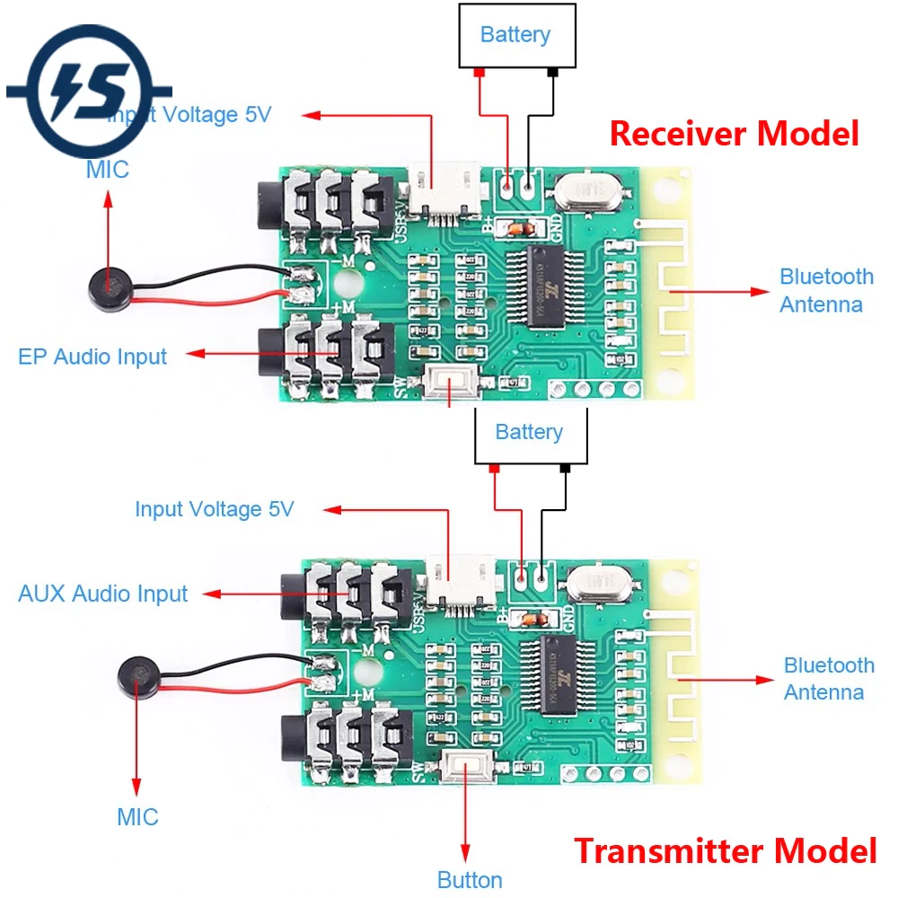

# Kosmodular Bluetooth Module

A self-build modular Bluetooth Receiver/ Transmitter in the Kosmo format so I can listen via Bluetooth Headphones. And you can too, the build can be done with little experience, but basic tools and skills are required. 

## Module features:

- Bluetooth Transmitter/ Receiver
- Stereo Input and Output
- Gain Potentiometer
- 1 Button (Mute, Power, Pairing)
- 4.2 Bluetooth

As the Bluetooth module i use a off the shelf 4.2 **Bluetooth Circuit Board**: https://de.aliexpress.com/item/4000971226657.html
The Board has all the features (Transmitter and a Receiver) I need and it's quite cheap so it was a no-brainer. It is driven with 5V over USB which is perfect since Kosmo uses the Eurorack Power System, which has a 5V Pin.

### About **Kosmo**:

**https://www.lookmumnocomputer.com/modular**

## Module Specs

- 20cm x 5cm Kosmo compatible Module
- Power Connector is a Eurorack Power Cable
- 20cm x 5 cm x ??cm

## Images

